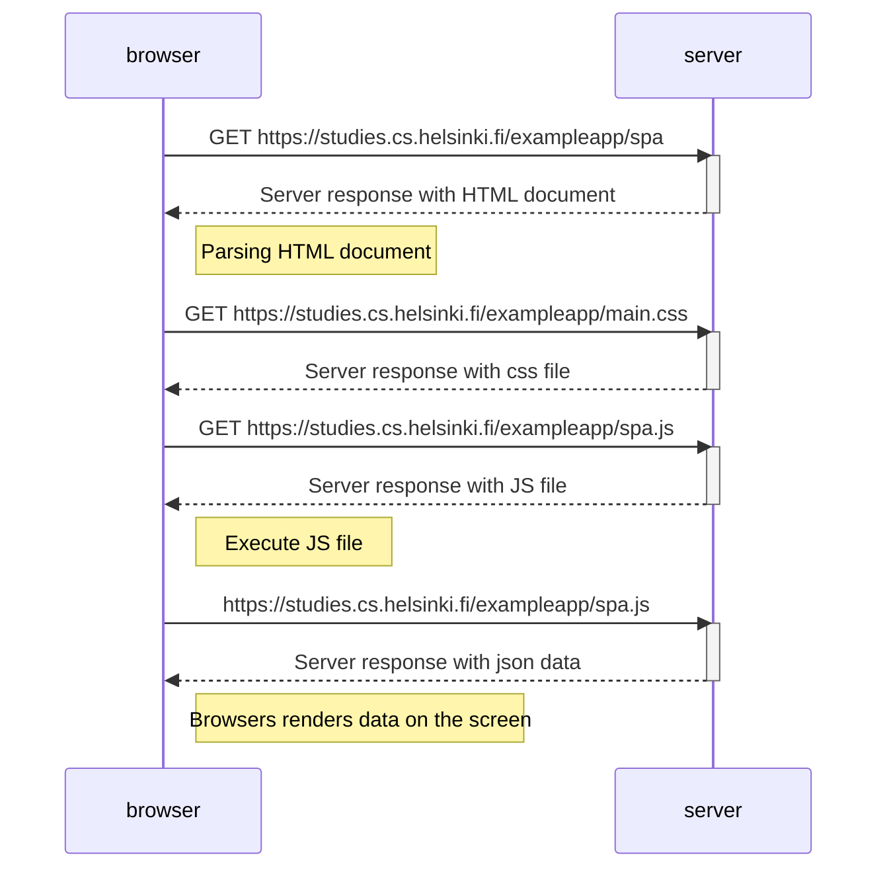

```mermaid
sequenceDiagram
    participant browser
    participant server

    browser->>server: GET https://studies.cs.helsinki.fi/exampleapp/spa
    activate server
    server-->>browser: Server response with HTML document
    deactivate server

    Note right of browser: Parsing HTML document
    browser->>server: GET https://studies.cs.helsinki.fi/exampleapp/main.css
    activate server
    server-->>browser: Server response with css file
    deactivate server

    browser->>server: GET https://studies.cs.helsinki.fi/exampleapp/spa.js
    activate server
    server-->>browser: Server response with JS file
    deactivate server

    Note right of browser: Execute JS file
    browser->>server: https://studies.cs.helsinki.fi/exampleapp/spa.js
    activate server
    server-->>browser: Server response with json data
    deactivate server

    Note right of browser: Browsers renders data on the screen
```
