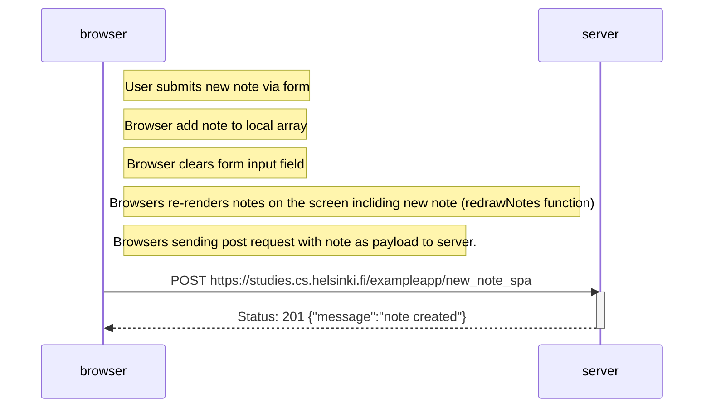

```mermaid
sequenceDiagram
    participant browser
    participant server

    Note right of browser: User submits new note via form
    Note right of browser: Browser add note to local array
    Note right of browser: Browser clears form input field
    Note right of browser: Browsers re-renders notes on the screen incliding new note (redrawNotes function)
    Note right of browser: Browsers sending post request with note as payload to server.

    browser->>server:  POST https://studies.cs.helsinki.fi/exampleapp/new_note_spa
    activate server
    server-->>browser: Status: 201 {"message":"note created"}
    deactivate server
```
